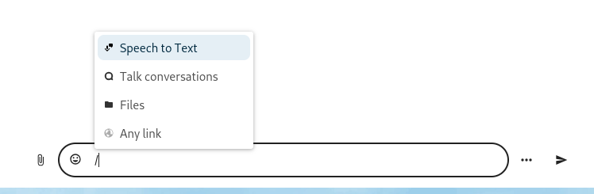
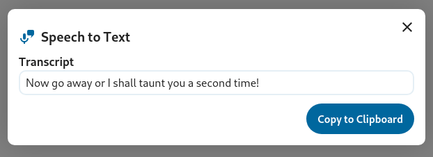

# Speech to Text Helper App

This app implements a smart picker provider that utilises the Speech to Text OCP API.  
It enables the user to generate transcriptions of recorded audio or an audio file provided.

NOTE: This integration requires a separate integration to be installed that exposes a SpeechToText processing provider, like the Whisper Speech-To-Text App, for example.

## 🖼️ Screenshots

  
  
  

